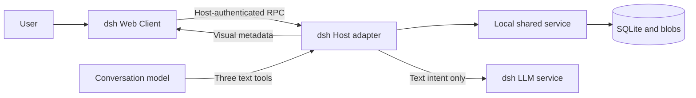

# Architecture and current protocol

[中文](architecture.md) · [Documentation](README.en.md)

## Component boundaries

`src/dsh/client.tsx` integrates the native composer and conversation rendering. Management uses bounded same-origin Host RPC. `src/dsh/host.ts` derives identity from real host sessions/turns, implements public tools, and reconciles delivery. `src/dsh/ai-suggestions.ts` uses the host LLM service to generate candidate text without writing the library.

`src/shared-client.ts` performs service handshakes and connection management. `src/shared-service.ts` is the local single-writer service, while `src/library-store.ts` persists library entries, immutable revisions, drafts, message snapshots, credentials, and receipts. A SQLite exclusive lock prevents simultaneous core writers. `blobs/` is SHA-256 addressed, with full media decoding validation.

The shared service listens on loopback and requires local capabilities, service identity, and connection bindings. Browsers access the Host through dsh Connection authentication and do not receive the core secret. Local clients share a library; messages are isolated by host, instance, and session. This is a local application boundary, not an Internet multitenant-service design.

## Four separate versions

| Object | Current version | Authority |
| --- | --- | --- |
| Product / dsh package | 1.0.0 | `package.json` / `adapters/dsh/package.json` |
| Expression and pack schema | `0.1` | [JSON Schema](specs/amoji-v0.1.schema.json) |
| Shared API | `2` | `src/shared-contract.ts` |
| Database | `4` | `src/shared-contract.ts` |

Product 1.0 does not rewrite stored `schema_version` values to `1.0`. The JSON Schema remains a runtime validation input. Current code, guides, and release acceptance define current behavior; older prose specifications remain available in Git history.

## Expressions, revisions, and two projections

A stable `asset_id` identifies an expression; changes create a new `revision_id`. Exact revisions contain names, semantics, media references, and rights. Library entries point to current revisions while messages freeze their original versions. Appearance changes, archiving, and version selection do not rewrite history.

The model projection selects only `asset_id`, `revision_id`, `name`, and `semantics`. Semantics contain `locale`, `meaning`, `fallback`, and optional `tone`, `use_when`, `avoid_when`. Visual metadata goes separately to the Client, without model image input. The model does not infer descriptions from artwork and cannot override semantics or choose arbitrary target sessions through these tools.

| Tool | Input | Behavior |
| --- | --- | --- |
| `amoji_search` | `query`, optional `limit` (default 3, range 1–5) | Full candidate text and `selection_token` bound to the current session/turn |
| `amoji_resolve` | `asset_id`, `revision_id` | Read exact revision text without sending |
| `amoji_emit` | `selection_token` | Send using a valid selection; no image path or semantic override |

Search is bounded by candidate count and an 8 KiB text budget; no match yields no candidates. Sending follows personal preferences and turn constraints. Expressions cannot substitute for authorization or evidence of task completion.

## Delivery and display states

| State | What it establishes |
| --- | --- |
| `prepared` | Core prepared a message without host delivery confirmation |
| `accepted` | dsh queued the input; a session flush completed, but native user-message persistence still requires reconciliation |
| `observed` | The matching native user message and `rpcId` were observed |
| `unknown` | Delivery across the host boundary is uncertain; reconcile the original request |
| `rendered` | Client reported successful loading of matching message media |
| `fallback` | Text fallback is used; image success is not established |

Use `observed` to reconcile the matching native user message. `accepted` alone does not prove that message is persisted and is separate from image `rendered`. Native requests use `amoji:<message_id>` for correlation. Retries retain an idempotent request identity; disconnection does not automatically create or resend requests. Host acceptance, model processing, and browser display are separate evidence layers.

## Creation and pack format

Drafts may persist incomplete input. Final semantics and media must validate before preview confirmation. Confirmation checks draft versions to prevent concurrent overwrites. The name and fixed semantics together have a 4 KiB budget. AI suggestions return candidate fields subject to the same validation; human adoption, editing, saving, and preview confirmation remain distinct steps.

A `.amoji` pack is a ZIP containing `manifest.json` and content-addressed `blobs/`. The manifest includes `kind: amoji.pack`, `schema_version: 0.1`, pack identity, expression revisions, and default references, with exactly one in-pack default per asset. Imports validate schema, paths, CRC, SHA-256, decoded formats, media limits, and expansion budgets, rejecting conflicting immutable revisions.

See `src/packs.ts`, `src/media.ts`, `src/drafts.ts`, and the machine-readable [expression example](specs/examples/expression.example.json). New host integrations require their own identity, persistence, and rendering validation; legacy implementations are not proof of support.
