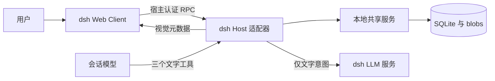

# 架构与当前协议

[English](architecture.en.md) · [文档首页](README.md)

## 组件边界

`src/dsh/client.tsx` 接入原生输入区与会话渲染；管理页通过受限同源 RPC 调用 Host。`src/dsh/host.ts` 从真实宿主会话和回合提取身份、调用公共工具接口，并处理投递核对。`src/dsh/ai-suggestions.ts` 使用宿主 LLM 服务生成待采用文字，不写核心库。

`src/shared-client.ts` 负责共享服务握手与连接；`src/shared-service.ts` 是本地单写入服务；`src/library-store.ts` 保存库条目、不可变版本、草稿、消息快照、凭据与回执。SQLite 排他锁阻止两个核心同时写入。`blobs/` 以 SHA-256 寻址，媒体经完整解码校验。

共享服务绑定本机回环地址，使用本地能力凭据、服务身份和连接绑定。浏览器经 dsh 的 Connection 认证访问 Host，不直接取得核心密钥。默认库供本地客户端共享；会话消息按宿主、实例、会话身份隔离。这是本地应用边界，不是多租户互联网服务设计。

## 四种不同版本

| 对象 | 当前版本 | 依据 |
| --- | --- | --- |
| 产品 / dsh 包 | 1.0.0 | `package.json` / `adapters/dsh/package.json` |
| 表情与包 Schema | `0.1` | [JSON Schema](specs/amoji-v0.1.schema.json) |
| 共享 API | `2` | `src/shared-contract.ts` |
| 数据库 | `4` | `src/shared-contract.ts` |

产品 1.0 不把存量 `schema_version` 改为 `1.0`。JSON Schema 是当前运行时校验输入；当前行为以代码、当前指南和发布验收为准；旧规格可通过 Git 历史追溯。

## 表情、版本与双投影

表情由稳定 `asset_id` 标识，修改生成新 `revision_id`。名称、固定语义、素材引用与许可保存在精确版本中；库条目指向当前版本，消息冻结当时版本。当前库的画风、归档或版本选择不回写历史。

模型投影只选择 `asset_id`、`revision_id`、`name`、`semantics`；固定语义包括 `locale`、`meaning`、`fallback`，以及可选的 `tone`、`use_when`、`avoid_when`。视觉元数据另行交给 Client，不混入模型图片输入。模型不根据图片生成描述，也不能通过工具覆盖语义或任意指定目标会话。

| 工具 | 输入 | 行为 |
| --- | --- | --- |
| `amoji_search` | `query`，可选 `limit`（默认 3，1–5） | 返回完整候选文字与绑定当前会话/回合的 `selection_token` |
| `amoji_resolve` | `asset_id`、`revision_id` | 读取精确版本文字，不发送 |
| `amoji_emit` | `selection_token` | 使用有效选择凭据发送；不接受图片路径或语义覆盖 |

搜索受候选数量和 8 KiB 文本预算限制；没有匹配返回空结果。发送遵循个人偏好与每回合约束，不能把表情当作绕过授权或报告任务完成的机制。

## 投递与显示状态

| 状态 | 能证明什么 |
| --- | --- |
| `prepared` | 共享核心已准备消息，尚无宿主投递确认 |
| `accepted` | dsh 已接收入队；虽然已完成一次会话 flush，原生用户消息是否落盘仍需核对 |
| `observed` | 已观察到对应原生用户消息和 `rpcId` |
| `unknown` | 跨宿主投递结果无法确认，需要核对原请求 |
| `rendered` | Client 报告匹配消息素材加载成功 |
| `fallback` | 使用文字回退；不表示图片成功 |

以 `observed` 核对对应原生用户消息；`accepted` 本身不能证明该消息已落盘，也不等于图片 `rendered`。原生请求使用 `amoji:<message_id>` 关联。同一发送请求保持幂等身份；断连不会自动换请求或重新发送。宿主接收、模型处理、浏览器显示分别记录，任一成功都不能代替其余步骤。

## 创作与包格式

草稿允许保存不完整填写；完整语义和媒体必须在预览确认前通过校验。确认采用草稿版本检查，防止并发修改覆盖。名称与固定语义总预算为 4 KiB。AI 建议只返回字段候选，经过同一正式校验；人类采用、编辑、保存和图文确认分开进行。

`.amoji` 是 ZIP，包含 `manifest.json` 与内容寻址 `blobs/`。清单记录 `kind: amoji.pack`、`schema_version: 0.1`、包身份、表达版本与默认引用；每个资产恰有一个包内默认版本。导入验证 Schema、路径、CRC、SHA-256、实际解码格式、媒体和展开预算，并拒绝冲突的不可变版本。

相关实现：`src/packs.ts`、`src/media.ts`、`src/drafts.ts`；机器可读示例见 [expression.example.json](specs/examples/expression.example.json)。兼容新宿主时应重新验证其身份、持久化与渲染合同；legacy 实现不是新宿主可用性的证明。
