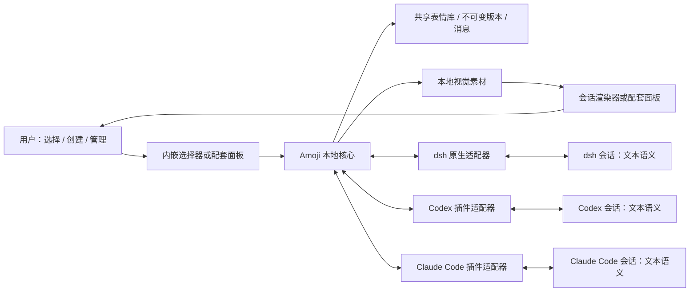

# Amoji 三端技术设计 v0.1

日期：2026-09-05。状态：可进入技术验证的设计草案，尚未实现。产品约束见 [PRD](../product/prd-v0.1.md)，数据合同见[协议](../specs/amoji-protocol-v0.1.md)。

## 1. 架构选择

采用“一个本地核心、一个共享表情库、三个宿主适配器”。核心维护资产、固定版本、检索、个人设置和消息记录；适配器处理宿主会话输入、展示和回放。

首版工程方案采用 TypeScript 核心、本地单用户服务、SQLite 元数据和按摘要保存的素材文件。它们是本次技术选择，不是用户已经指定的栈，也不构成实际依赖版本承诺。独立协议不绑定 TypeScript、SQLite 或某个模型供应商。

本期验收策略由用户修订为 Codex 基准：先在 Codex 完成真实双向接入与全部产品行为，再以同一公共合同实现其他两个适配器。dsh、Claude Code 的验证工具不可用时可以跳过真机测试，但仍须完成实际适配逻辑及可执行的构建、类型和合同检查，状态明确为“已实现、宿主未验证”。工具可用时继续实测，实际失败不能改记为环境跳过。

图像字节只进入人类视觉通道。模型根据已确认语义选择表情，不经过图像检索模型、视觉模型或专用情绪分类器。

## 2. 模块职责

| 模块 | 负责 | 不负责 |
|---|---|---|
| 资产核心 | 草稿确认、不可变版本、个人副本、导入导出、素材校验 | 宿主 UI 注册 |
| 库与检索 | 当前版本、归档、标签与文字检索、个人设置 | 自动重新定义语义 |
| 消息服务 | 固定快照、素材保留、投递记录、幂等 | 把“准备完成”当作用户已看到 |
| 模型工具层 | 精简候选、版本解析、AI 表情发送 | 向模型返回图像或完整表情库 |
| 配套面板 | 图像选择、创建、管理、当前会话关联、视觉回执 | 猜测正在使用哪个宿主会话 |
| 宿主适配器 | 实际会话身份、文字入站、视觉出站、持久记录对接 | 修改表情语义、共享错误会话状态 |

先按模块隔离职责；只有核心、服务、面板和分发适配器确实需要独立交付时才分包，不建立大量空包。

## 3. 共享运行时与本地存储

### 3.1 生命周期

- 三个插件连接同一个当前 OS 用户的 Amoji 服务。插件自己的安装缓存只存程序，库位于独立的用户数据目录。
- 使用系统用户数据目录：macOS、Linux、Windows 各按平台惯例解析；本地路径不是协议的一部分。
- 启动采用进程锁和健康握手，避免每个插件创建一份库或竞争启动多个写入者。
- 插件卸载断开自己的连接，不删除共享用户库；不因某一个插件卸载而终止其他客户端正在使用的服务。
- 协议握手携带 API 版本范围；不兼容客户端返回升级提示，不自动降级数据库。
- 首轮验证从当前 macOS 环境开始，其他 OS 单独列入支持矩阵；不将一次本机验证宣传成跨 OS 支持。

### 3.2 数据组织

| 本地记录 | 主要内容 |
|---|---|
| expressions | 身份、来源类别、个人可编辑归属 |
| revisions | 精确版本 JSON，不可变 |
| library_entries | 当前选用版本、归档状态、收藏等本地状态 |
| blobs | SHA-256、实际格式、路径和解码信息 |
| drafts | 未确认的文字与素材引用，不对模型搜索可见 |
| settings | 风格、频率、动画偏好及修改序号 |
| bindings | 宿主实例与真实会话标识的本地映射 |
| messages | 协议消息快照，关联版本及素材保留引用 |
| deliveries | 投递、显示回执、错误与去重键 |
| packs | 导入/导出记录及版本来源 |

共享服务是唯一写入入口。素材先校验并原子写入，随后事务提交引用；失败时允许留下未引用素材，禁止留下指向不存在素材的已完成版本。

编辑当前版本使用读取时的修改序号执行比较更新。两个客户端同时修改时提示冲突，不用“最后写入者覆盖”丢掉另一份定义。设置同样防止静默覆盖，变更通知其他客户端刷新。

归档移除检索可见性，保留历史引用；首版不提供自动永久删除历史素材的策略。库规模扩大后可以另行设计清理，但必须公开其历史影响。

## 4. 创建与导入实现

语义建议器只接受文字意图与用户输入的说明。可复用当前宿主的文本能力；无法使用时，面板提供完整手工编辑。核心不要求持有供应商密钥。

建议只能写入草稿。用户预览并确认后，核心校验语义预算、图像与包约束，生成版本。建议器不得自动确认、后台改写已用版本，或依靠一轮识图才允许用户继续。

原始素材导入走同一草稿流程。完整包走[协议导入事务](../specs/amoji-protocol-v0.1.md)，无需逐张重做语义确认。导出默认不包含设置、消息或会话绑定。

内置库安装为带明确版本的普通资产包，不采用与用户库不同的特殊语义格式。内置更新可新增版本，但不得重置用户的个人副本和当前选用版本。

开发样本和基础库图片通过 Codex imagegen 技能的内置工具生成，记录提示、来源与最终项目素材。动图需要单独封装和验证时长、封面及播放；生成图片本身不证明动画完成。生成与目视检查不混入纯文本接入的被测会话；正常收发表情的运行路径不调用 imagegen。

## 5. 模型工具合同

以下工具名、参数和行为是 Amoji 拟实现的接口，宿主可以添加自己的 MCP 名称前缀。核心只暴露三个日常工具；创作、设置、导入等管理功能经用户界面调用本地 API。

| 工具 | 模型提供的输入 | 返回 | 副作用 |
|---|---|---|---|
| `amoji_search` | `query`，可选 `limit` | 完整语义候选、准确引用、选择凭据、当前表达策略 | 建立短期选择凭据 |
| `amoji_resolve` | `asset_id`、`revision_id` | 精确版本的文本语义 | 无发送副作用 |
| `amoji_emit` | `selection_token` | 消息 ID、文本语义、投递状态 | 在已绑定当前会话中创建并投递一次 AI 表情 |

Codex 的用户选择入口补充（2026-09-15）：沿用已展示并继续实现的 `/amoji → amoji_pick → 配套面板` 路径。`amoji_pick` 是用户请求选图时调用的宿主控制入口，参数为空；同一次 MCP 调用等待用户操作后，只返回选中版本的固定文本语义。它不允许 AI 自行填入图片、语义或目标会话，也不增加创作和管理工具。三个日常表达工具的合同不变。该路径已在安装版 Desktop 实测；无需调用当前开发任务内部的消息插入 API。用户取消或连接失效时不猜测其他目标。

### 5.1 检索

初始方案为本地名称、标签、含义与语境的确定性文字索引，先实现中文子串/分词和可解释排序。无需向量服务或每次模型分类。后续替换排序不改变协议。

- `query` 为 1–240 字；`limit` 默认 3、最大 5。
- 只检索当前库可用版本；草稿、归档项不作为 AI 新发候选。
- 返回语义完整的候选；不裁剪掉 `avoid_when` 等字段后让模型作决定。
- 结果 UTF-8 文本总预算为 8 KiB。超预算减少候选数量，至少能够返回一个合法候选；不静默截断语义。
- `selection_token` 是服务生成的短期随机凭据，绑定候选精确版本、当前会话关联与产生它的操作上下文，模型不能指定其他目标会话。
- 凭据初始有效期 5 分钟；过期或库状态变化时重新检索。凭据不是账号密钥，但也不应被跨会话复用。

### 5.2 解析

解析仅按精确 ID 取值，不接受 `latest`、名字或模型生成的语义覆盖。人类输入包含表情引用时，优先由适配器在投递前本地展开，省去一次模型工具往返。

不能本地展开的实验路径可由模型调用解析工具；它证明文本兼容性，但是否达到完整人类选择发送体验须另验。历史精确解析可访问归档版本，不因此允许 AI 将归档版本作为新发表情。

### 5.3 AI 发送与幂等

发送工具不接受 `meaning`、`tone`、任意图片路径、目标会话 ID 或整个消息对象。服务从选择凭据恢复引用和绑定，并再次检查版本可用性及用户设置。

第一次成功创建消息后，凭据记录其 `message_id`。对同凭据的重试返回原消息与当前状态，禁止再创建一条。查找既有消息先于过期和策略检查，确保已成功操作可以稳定查询。

同样表情的后续独立表达需要新选择凭据。用户手动发送使用面板生成的 `send_request_id`，传输重试复用 ID；不同用户点击生成不同 ID。

所有候选和工具返回默认使用一个明确的文本内容块，不同时复制一份完整语义到多个模型可见字段。需要结构化结果的宿主由适配器选择一种经验证的无重复映射。

### 5.4 表达策略

固定工具说明告诉模型何时查找、何时不必使用以及不得识图。不会把整库写进 Skill 或每回合提示。

工程默认：每个 AI 回合至多一条、避免连续重复同一表情；克制模式额外冷却一个完整回合。用户手动发送不受 AI 频率上限影响。“适中 / 活跃”调整冷却和使用建议，暂停则直接禁止新的 AI 发送。

强制回合上限需要可信宿主回合标识。适配器没有该标识时应报告策略能力不足，并在技术验证中解决，不能让模型自己填写回合号来绕过限制。风格主要影响选择，不能改写选定版本的语义。

## 6. 会话绑定是接入核心

有效绑定至少关联：宿主种类、宿主实例、稳定的真实会话标识、适配器实例和可用投递/展示能力。服务生成 `binding_id`；真实宿主标识不进入导出包。

- 优先使用公开的会话生命周期、扩展 API 或经过验证的独立会话进程入口。
- 不把工作目录、最近活跃窗口、MCP 服务器进程或模型自报的 ID 默认当作真实会话。
- 面板显示宿主与会话名称，发送前目标明确；切换窗口不能让待发消息悄悄改目标。
- 会话切换或恢复时重新确认绑定有效性；断开后面板显示未关联，不能降级发送到“最近会话”。
- 普通 MCP 的一次工具调用不天然证明当前会话身份；必须逐宿主验证插件能取得何种可信上下文。
- 不使用本 Codex 会话内部可用的任务工具作为第三方插件可分发 API 的依据。

仅在必要时增加显式的用户配对动作；它建立适配器与面板的关联，不让模型任意选择跨会话收件人。具体宿主获取会话身份的方法由验证工作包落实，当前不捏造不存在的 Hook 字段。

## 7. 投递与显示状态

消息创建与待投递记录在同一个本地事务中完成，再调用宿主。两个事实分别记录：

| 维度 | 状态 | 含义 |
|---|---|---|
| 宿主投递 | pending / submitted / acknowledged / failed / unknown | 尚未投递、已提交、宿主确认记录、明确失败、无法判断 |
| 人类显示 | pending / rendered / fallback / failed / unknown | 待显示、视觉加载完成、只显示替代文本、失败、无回执 |

`acknowledged` 表示进入宿主会话记录，不声称 AI 已理解或人已阅读。`rendered` 表示对应图片成功加载并显示，不等于人注意到了它。

投递过程：

1. 核心固定版本，建立消息快照、保留素材并记录去重键。
2. 适配器以同一个消息 ID 提交文本语义及展示事件。
3. 宿主确认后更新投递记录；渲染器依据同 ID 报告显示结果。
4. 服务中断恢复后，查询宿主记录并重建状态。宿主没有查询/幂等能力时保留 unknown，不自动重发。
5. 用户可看到失败或未知状态并主动处理；不能仅凭 HTTP 成功或工具返回就显示“已送达并展示”。

首版不承诺跨数据库与第三方会话的全局 exactly-once。通过本地幂等、宿主确认与保守重试避免静默重复；验收覆盖崩溃和超时边界。

## 8. 三端适配设计

### 8.1 dsh

已确认的源码能力：Cordis Host/Client 双入口、工具注册、持久化展示元数据、客户端 Slots 与 Conversation 扩展。基线固定在 `d347e703908d0406b7a7ef80e3a0e594d86b2215`；这不等于后续所有发行版兼容。详见[dsh 调研](../research/deepseek-dsh-plugin-research-2026-09-05.md)。

实施方案：

- Host 连接共享核心，将三个工具映射为 dsh 工具，模型输出只渲染文本。
- 人类输入优先通过可回放的用户消息记录路径进入会话；若新增事件，必须补齐模型投影与历史回放，不能只调用临时上下文注入。
- Client 提供表情选择入口和视觉渲染，按固定版本显示。
- 对工具卡片使用真实 wire tool name 注册 `tool.call.toolview`；Web 不消费 Host `presentCall/presentResult`，不能只写后端 presenter。
- 展示事实写入持久记录；React 临时状态不能是历史图片唯一来源。
- 构建须生成 dsh Client loader 接受的工厂产物，按官方共享模块约定处理 React/Cordis。验证外部包能独立构建和安装，不假设可直接复制 monorepo 构建脚本。

依据：[Web client presentation](https://github.com/deepseek-ai/deepseek-harness/blob/d347e703908d0406b7a7ef80e3a0e594d86b2215/docs/cookbook/adding-a-tool.md#web-client-presentation)、[Client module system](https://github.com/deepseek-ai/deepseek-harness/blob/d347e703908d0406b7a7ef80e3a0e594d86b2215/packages/client/modules/README.md)。

### 8.2 Codex

分发方案为 Codex 插件，包含 Skill 与本地 MCP 适配入口；采用该平台 manifest 约定。共享核心不依赖 Codex 的内部任务工具。

当前本会话宿主允许 Markdown 引用本地图片，可作为 Desktop 输出原型候选；这是本会话约定，不是已验证的第三方插件接口。若适配器必须向模型提供本地图片地址以生成 Markdown，只能提供对应已选版本的纯文本地址，禁止返回图像内容块，并单独验证首次发送、续聊和重开历史的真实请求。

原生选择器与 MCP Apps bridge 在目标客户端的能力必须探测。官方 UI 指南以 ChatGPT iframe 为具体实现；不能把共享插件目录当作全部 Codex 客户端支持同样 UI 的证据。依据：[插件架构](https://developers.openai.com/plugins/concepts/plugins)、[UI 指南](https://developers.openai.com/plugins/build/chatgpt-ui)。

如原生入口不足，使用配套面板。只有稳定会话绑定、用户点击发送和 AI 表情自动显示均跑通，才标为支持。Codex CLI 独立验收；终端可显示图片不代表 Codex TUI 接受插件图片组件。

### 8.3 Claude Code

分发方案为 Claude Code 插件，包含 Skill 和 `.mcp.json` 本地服务入口。插件支持这些组件有官方依据；第三方原生图片选择器和 renderer 仍未证实。依据：[Plugins reference](https://code.claude.com/docs/en/plugins-reference)。

主方案为共享配套面板加经验证的会话适配。输入选择需要投递文字语义，输出由 `amoji_emit` 写入核心后通知绑定面板显示。不得用 MCP image content 作为给人看图的捷径。

channels 可用作条件允许环境的增强路线，官方有双向 web UI 示例，但有研究预览及允许名单门槛，不将开发绕过标志作为面向所有用户的默认依赖。依据：[Channels reference](https://code.claude.com/docs/en/channels-reference)。

CLI 与 IDE 分别验证。若只证明“复制一个引用让模型解析”，仍标为实验兼容路径，不算正式双向视觉闭环。

### 8.4 当前状态

| 目标 | 工具/协议依据 | 图片呈现 | 选择并送入当前会话 | 本次运行验证 |
|---|---|---|---|---|
| dsh Web | 源码确认 | 扩展点确认，Amoji 待实现 | 持久用户输入适配待验证 | 未执行 |
| Codex Desktop | 文档确认 | 本会话约定，插件路径待验证 | 待验证 | 未执行 |
| Codex CLI | 文档确认 | 原生未知，面板方案待验证 | 待验证 | 未执行 |
| Claude Code CLI | 文档确认 | 面板方案待验证 | 常规绑定待验证；channels 有条件 | 未执行 |
| Claude Code IDE | 插件能力有依据 | 具体界面待验证 | 待验证 | 未执行 |

## 9. 本地界面与数据边界

本地服务优先使用用户权限限制的 IPC；配套浏览器面板需要 loopback HTTP 时，仅监听回环地址并进行来源与会话令牌校验，不将“来自 localhost”单独当作授权。

面板只按已验证素材摘要取文件，不接受任意绝对路径读取。包内文本按普通文本显示，不执行 HTML、脚本或模板；不通过命令字符串拼接处理名称、标签或许可说明。

模型日常工具不具备资产重写、导入、永久删除或任意网络发送权限。表情表达不会绕过宿主已有审批。模型供应商是否保留正常对话按宿主政策处理；“本地优先”只承诺 Amoji 库默认在本机，不能声称语义永不随会话发送到远端模型。

## 10. 成本与响应目标

- 空闲时不轮询模型，不运行情绪推断服务。
- 未使用表情时只保留简短工具/Skill 说明，不注入全库。
- 一次 AI 表达通常为一次检索加一次发送；精确人类输入由本地展开时不增加专用模型回合。
- 报告文本 Token、工具往返、宿主注入开销与实际图像内容数量，不能只说“零成本”。
- 实验目标：1000 个当前表情的本地热检索 p95 不超过 150 ms，素材已缓存的面板显示 p95 不超过 300 ms。网络模型延迟单列，不能混入本地渲染指标。
- 上述数字是待测预算，不是已实现结果；按设备、宿主版本、数据规模记录，必要时据实调整。

## 11. 工程顺序与退出条件

先用三个小样在 Codex 验证完整接入，再实现共享核心和完整功能；dsh、Claude Code 基于公共合同实现适配，不作为共享核心开工的真机前置条件。最后完成 Codex 干净安装验收与三端实现/验证状态清单。

若其他宿主仅缺少验证工具，完成可执行检查并记录跳过原因、用例和补验步骤，不阻塞本期 Codex 交付。若发现缺少必要公开能力或已运行失败，保留对应实现缺口或失败状态，不能以环境跳过掩盖；是否需要改动公共合同按真实证据处理。Codex 自身仍须有完整真实接入证据，不能用自建客户端或仅文本路径替代。

详细工作包、测试和交付证据见[验收与实施顺序](../planning/acceptance-v0.1.md)。
