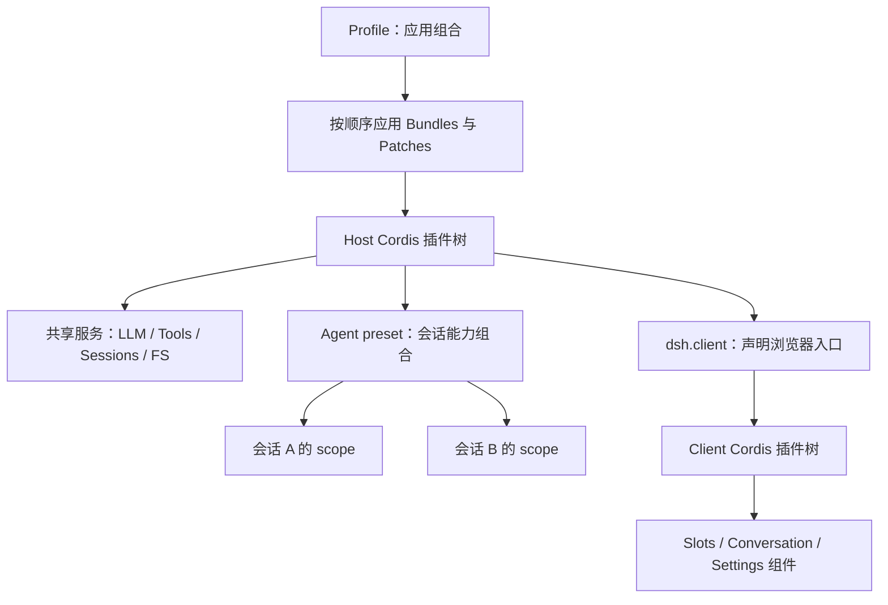

# DeepSeek Harness（dsh）插件机制与能力调研

调研日期：2026-09-05。对象为 DeepSeek 官方项目 `deepseek-ai/deepseek-harness`。本文依据官方源码、仓库文档、相关测试源码和 npm registry；不使用第三方插件聚合站的统计作为能力证据。

## 1. 结论

**dsh 是以 Cordis 为组合内核的 Agent 运行时。插件能够扩展或替换模型适配、工具执行、上下文、会话持久化、子 Agent、工作流和 Web 界面。其扩展深度覆盖 Harness 本身。** 工具注册表和默认 Agent 循环也由插件提供。[架构](https://github.com/deepseek-ai/deepseek-harness/blob/d347e703908d0406b7a7ef80e3a0e594d86b2215/docs/architecture.md)

它最有研究价值的设计是：

1. **反应式服务依赖**：消费者通过 `inject` 声明依赖，服务出现才激活，消失则卸载，恢复后重新激活。
2. **可撤销的运行时注册**：工具、监听器、子插件及纳入 `ctx.effect()` 的资源跟随插件生命周期清理。
3. **分层组合**：整个应用由 profile、bundle 和 patch 组装；会话由 preset 选择能力；scope 控制注册可见性，`isolate` 控制服务实例的解析域。
4. **模型输入可追溯**：模型可见的输入要求能够从会话日志重建，工具输出与 UI 展示分开设计。
5. **Host 与 Client 都可插件化**：可以同时提供后端能力和浏览器组件，也可以让模型临时生成动态插件。[Cordis 入门](https://github.com/deepseek-ai/deepseek-harness/blob/d347e703908d0406b7a7ef80e3a0e594d86b2215/docs/cordis-primer.md)、[生命周期](https://github.com/deepseek-ai/deepseek-harness/blob/d347e703908d0406b7a7ef80e3a0e594d86b2215/docs/cordis-tutorial/02-lifecycle-and-effects.md)

**采用判断：适合做可信环境中的定制 Agent、工具集和运行时实验；作为长期产品底座时，需要自行承担预稳定 API 的升级成本，并另外设计不可信代码隔离。** 这是基于接口覆盖范围和官方安全声明的工程判断。官方仍明确标为 developer preview，表示会有破坏兼容的变更，并声明尚未经过安全审计。[README](https://github.com/deepseek-ai/deepseek-harness/blob/d347e703908d0406b7a7ef80e3a0e594d86b2215/README.md)、[SAFETY](https://github.com/deepseek-ai/deepseek-harness/blob/d347e703908d0406b7a7ef80e3a0e594d86b2215/SAFETY.md)

## 2. 版本与证据范围

| 项目 | 本次核查结果 |
|---|---|
| 官方仓库 | `https://github.com/deepseek-ai/deepseek-harness` |
| 源码基线 | `d347e703908d0406b7a7ef80e3a0e594d86b2215`，2026-09-04，对应 `dsh-v0.1.3-alpha.1` |
| 源码 package 版本 | `0.1.3-alpha.1` |
| npm `latest` / `next` | `0.1.2-rc.1`，发布时间 `2026-09-03T06:21:52.107Z` |
| npm `alpha` | `0.1.2-alpha.5` |
| 发布差异 | 本次取得的 npm registry 版本表中尚无 `0.1.3-alpha.1` |
| 源码 Node 要求 | `^22.19.0 || >=24.0.0` |
| vendored Cordis | `@deepseek-ai/cordis`，`4.0.2` |
| 许可证 | MIT，另列第三方 notices |

证据：[固定提交](https://github.com/deepseek-ai/deepseek-harness/commit/d347e703908d0406b7a7ef80e3a0e594d86b2215)、[根 package.json](https://github.com/deepseek-ai/deepseek-harness/blob/d347e703908d0406b7a7ef80e3a0e594d86b2215/package.json)、[npm registry 元数据](https://registry.npmjs.org/@deepseek-ai%2Fdsh)、[Cordis manifest](https://github.com/deepseek-ai/deepseek-harness/blob/d347e703908d0406b7a7ef80e3a0e594d86b2215/vendor/cordis/package.json)。npm dist-tag 会变化，以上是调研时的读取结果。

本文的默认基线是固定源码提交。另取 `dsh-v0.1.2-rc.1` 对照，以下路径与该提交之间没有差异：`packages/core/tools/src/`、`packages/extensions/tool-cordis/src/index.ts`、`packages/extensions/cordis-host-runner/src/index.ts`、`docs/user/develop/basic/publish.md`、`packages/client/tsdown.client.ts`。这个比对只证明所列文件相同，不代表两个版本整体兼容。

验证方式是源码与文档交叉阅读、发布元数据查询及 Git 版本对照。**本次未安装/启动 dsh，未调用模型，未运行测试套件，也未执行下文示例。** 引用测试表示存在相应用例，不表示本次已运行通过。源码 checkout 位于临时目录，当前工作区只落地本报告。

## 3. 先区分六个概念

| 概念 | 作用 | 常见误解 |
|---|---|---|
| Plugin | 可加载的模块，提供服务、工具、事件或界面 | 插件不只等于模型工具 |
| Service | 通过 `ctx.<name>` 暴露的能力接口 | 消费者依赖接口名，不直接绑定具体实现 |
| Bundle | 可分发的插件代码与 Cordis patch 层，manifest 声明 `dsh.bundle` | 安装普通依赖不等于自动挂载插件 |
| Profile | 整个应用的组合，包含 bundle 列表、本地依赖及用户 patch | `web`、`sdk` 等是应用形态 |
| Agent preset | 某类会话的插件组合，核心文件为 `agent.cordis.yml` | `standard`、`minimal`、`ptc`、`cordis` 是会话能力选择 |
| Scope / isolate | 前者控制注册的可见性和寿命，后者隔离服务解析域 | 二者都不是进程、容器或安全沙箱 |

Profile 通常位于 `$DSH_HOME/profiles/<name>`；用户 preset 通常位于 `<dshHome>/.agent-presets/<id>/`。官方界面中的 Code / Creator 分别对应源码中的 `ptc` / `cordis` preset。不要把产品显示名称直接当作目录或接口标识。[应用组合](https://github.com/deepseek-ai/deepseek-harness/blob/d347e703908d0406b7a7ef80e3a0e594d86b2215/docs/architecture.md)、[preset 实现](https://github.com/deepseek-ai/deepseek-harness/blob/d347e703908d0406b7a7ef80e3a0e594d86b2215/packages/preset/agent-presets/README.md)、[内建 presets](https://github.com/deepseek-ai/deepseek-harness/tree/d347e703908d0406b7a7ef80e3a0e594d86b2215/packages/preset/agent-presets/presets)



## 4. 插件内核如何工作

### 4.1 入口、依赖与配置

普通插件可以采用函数、带 `apply(ctx, config)` 的对象/模块，或者 `Service` 子类。最常见的模块导出 `name`、`inject`、`Config` 和 `apply`，其中 `Config` 用 `@deepseek-ai/schemastery` 验证部署配置。服务和事件的 TypeScript 类型通过 declaration merging 扩展。[插件入门](https://github.com/deepseek-ai/deepseek-harness/blob/d347e703908d0406b7a7ef80e3a0e594d86b2215/docs/user/develop/basic/index.md)、[配置教程](https://github.com/deepseek-ai/deepseek-harness/blob/d347e703908d0406b7a7ef80e3a0e594d86b2215/docs/user/develop/basic/config.md)

插件模块导出的 `name` 主要用于诊断；loader 配置行的 `name` 是要解析的模块指定符，两者不要混淆。配置还支持 `!!js` 表达式，用于 `config` 和 `disabled`，例如引用环境变量；其他 metadata 保持字面值。因此 composition 不是无执行能力的纯 JSON 配置，也应当作为可信代码的一部分审查。[Loader 表达式规则](https://github.com/deepseek-ai/deepseek-harness/blob/d347e703908d0406b7a7ef80e3a0e594d86b2215/docs/cordis-primer.md#loader-configuration)

例如工具消费者声明 `inject = ['tools']`。Cordis 在 `ctx.tools` 可用时运行 `apply`；服务消失会撤销依赖者的注册，服务恢复后再运行。可选能力可以使用 `ctx.inject([...], callback)` 或按调用时需要查询服务，具体选择取决于是否需要跟随服务生命周期。[服务教程](https://github.com/deepseek-ai/deepseek-harness/blob/d347e703908d0406b7a7ef80e3a0e594d86b2215/docs/cordis-tutorial/03-services.md)

### 4.2 生命周期与资源清理

教程给出的典型状态为 `PENDING → LOADING → ACTIVE → UNLOADING → DISPOSED`，加载异常进入 `FAILED`。`ctx.plugin()` 返回 fiber，可等待其 `dispose()` 完成；子插件随父插件卸载。缺少依赖时 Cordis 本身可以保持 PENDING，而 dsh 的应用启动/preset 挂载审计会报告未满足依赖，不能将两层的行为混为一谈。[生命周期](https://github.com/deepseek-ai/deepseek-harness/blob/d347e703908d0406b7a7ef80e3a0e594d86b2215/docs/cordis-tutorial/02-lifecycle-and-effects.md)、[启动审计](https://github.com/deepseek-ai/deepseek-harness/blob/d347e703908d0406b7a7ef80e3a0e594d86b2215/packages/boot/app-boot/README.md)

`ctx.on()`、`ctx.plugin()` 和 `ctx.tools.register()` 已纳入 effect 管理。原生定时器、网络连接、文件 watcher 等自行获取的资源，应放入 `ctx.effect()`，返回释放函数。多个异步 disposer 可能并发执行，需要严格先后顺序时应合并为一个 disposer 并自行 `await`。[工具注册实现](https://github.com/deepseek-ai/deepseek-harness/blob/d347e703908d0406b7a7ef80e3a0e594d86b2215/packages/core/tools/src/index.ts#L1022-L1052)、[scope effect 实现](https://github.com/deepseek-ai/deepseek-harness/blob/d347e703908d0406b7a7ef80e3a0e594d86b2215/packages/core/scope/src/store.ts#L215-L260)

**可撤销的是已登记的运行时贡献。它不自动撤销工具已经写入的文件、数据库更新或发出的外部请求。** 这是 effect 清理契约的边界；业务回滚和幂等必须另行设计。

### 4.3 事件并非一律广播

Cordis 提供 `emit`、`parallel`、`serial`、`bail`、`waterfall`。应遵守每个事件声明的 mode，不能随意替换调度方法。

`waterfall` 是带 `next()` 的环绕中间件：不调用 `next()` 就会截断后续链。观察/补充逻辑应委托下游；明确拒绝调用的策略可以有意截断。尤其不要把普通线性“数据依次转换”框架的 waterfall 心智模型直接套用。[事件契约](https://github.com/deepseek-ai/deepseek-harness/blob/d347e703908d0406b7a7ef80e3a0e594d86b2215/docs/user/develop/framework/events.md)

还有两个不同的事件层：`tools/pre-execute` 等是进程内 Cordis 事件；`tool/call`、`tool/result`、`turn/*` 是持久化 Session 记录。观察后者应监听 `session/event` 并判断 `event.type`。

## 5. 能力地图

| 开发目标 | 主要扩展点 | 官方实现与边界 |
|---|---|---|
| 新增业务工具 | `ctx.tools.register(defineTool(...))` | 参数验证、输出 schema、取消、执行策略；注册后可进入 native / PTC 工具视图 |
| 新模型/网关 | `ctx.llm.registerAdapter()`、`LlmAdapter` | direct DeepSeek 与 pi-ai 适配器；自定义 OpenAI-compatible 网关常可先通过 pi-ai 配置实现 |
| 系统提示与动态上下文 | `ctx.systemPrompt.section()`、`agent.inject()`、`agent/pre-step` | inject 进入后续被接纳的请求，本身不唤醒空闲 Agent |
| Skill 来源 | `ctx.skills` provider | 本地 `SKILL.md`、自定义/远端来源；目录信息与正文按需加载分开 |
| 工具审批、拦截和审计 | `tools/pre-execute`、`ctx.tools.guard()`、`tools/result` | guard 只能拒绝或不表态，不能重新允许其他 guard 已拒绝的调用 |
| 超时、重试、结果处理 | `tools/execute`、`tools/post-execute` | 同进程异步代码必须配合取消，不能被任意强杀 |
| FS、Shell、PTY、LSP | `ctx.fs`、`ctx.subprocess`、`ctx.shell`、`ctx.terminals`、`ctx.lsp` | 通过服务定义/实现/消费者拆分；更换执行环境须保持文件与进程世界一致 |
| 同机子进程约束 | `ctx.sandbox` | 文件效果策略：read-only / workspace-write / danger-full-access；不是通用网络/凭据隔离策略 |
| 会话存储、回放、查询 | `ctx.sessionPersistence`、`ctx.sessionProjections`、`ctx.sessionQuery` | JSONL、日志投影与查询能力分开，可替换 persistence 实现 |
| 非会话数据 | `ctx.storage`、`ctx.storageDomain` | 官方有 JSON / SQLite 等实现，生命周期和迁移由数据域负责 |
| 子 Agent | `ctx.subagents` provider | spawn、fork、DSH SDK、ACP、Codex、Claude Code 等后端，具体能力不完全相同 |
| 编排与后台任务 | `ctx.workflowEngine`、`ctx.jobs` | workflow 脚本组合子 Agent；后台任务另有所有权、取消和收集契约 |
| 外部事件触发 | `ctx.webhookRuntime` + provider adapter | 创建 Workspace Session；默认没有持久消息队列、去重或完成回执 |
| 人类命令 | `ctx.commands` | 命令可直接分发，无须启动模型回合 |
| Web UI | `dsh.client`、Slots、Conversation registries | 可贡献设置、会话内容、工具卡片等；Host/Client 分开编译和加载 |
| 临时自扩展 | `cordis_define/run/stop/undefine` 与 inspect 工具 | 模型生成进程内动态插件，可含 Host/Client 两部分 |

能力接口全貌见[生成的服务关系图](https://github.com/deepseek-ai/deepseek-harness/blob/d347e703908d0406b7a7ef80e3a0e594d86b2215/docs/capability-seams.md)。具体边界依据：[工具指南](https://github.com/deepseek-ai/deepseek-harness/blob/d347e703908d0406b7a7ef80e3a0e594d86b2215/docs/cookbook/adding-a-tool.md)、[pi-ai provider](https://github.com/deepseek-ai/deepseek-harness/blob/d347e703908d0406b7a7ef80e3a0e594d86b2215/packages/llm/llm-pi-ai/README.md)、[子 Agent](https://github.com/deepseek-ai/deepseek-harness/blob/d347e703908d0406b7a7ef80e3a0e594d86b2215/packages/subagent/subagent/README.md)、[工作流](https://github.com/deepseek-ai/deepseek-harness/blob/d347e703908d0406b7a7ef80e3a0e594d86b2215/packages/workflow/workflow/README.md)、[Webhook](https://github.com/deepseek-ai/deepseek-harness/blob/d347e703908d0406b7a7ef80e3a0e594d86b2215/packages/webhook/webhook/README.md)。

新增 LLM adapter 时，需要实现 `stream(options): AsyncIterable<StreamChunk>`，并按需提供 `resolveModel()` 等模型元数据接口。Provider route 注册不可冲突；流协议要求 usage 在 finish 前、finish 后不再发数据，工具参数以原始 JSON 字符串流转，I/O 配合 AbortSignal。无法支持的选项应明确报错，provider 原生续接数据通过规定的 replay state 路径保留。这意味着“接一个模型”不仅是转发 HTTP，还要满足会话回放与流式工具调用的语义。[LLM adapter 指南](https://github.com/deepseek-ai/deepseek-harness/blob/d347e703908d0406b7a7ef80e3a0e594d86b2215/docs/cookbook/adding-an-llm-adapter.md)

## 6. 工具插件的实际开发契约

### 6.1 一个最小示例

下面是按当前 `defineTool` API 编写的示例。它仅演示接口，不访问文件或网络，**未执行或编译验证**。

```ts
import type { Context } from '@deepseek-ai/cordis'
import { defineTool } from '@deepseek-ai/dsh-tools'

export const name = 'example-greeting'
export const inject = ['tools']

export function apply(ctx: Context) {
  ctx.tools.register(defineTool({
    name: 'example_greet',
    description: '根据姓名返回一句问候。',
    parameters: {
      person: { type: 'string', required: true },
    },
    output: {
      schema: { type: 'string' },
      render: (_args, value) => [{ type: 'text', text: value }],
    },
    async execute({ person }, exec) {
      exec.signal.throwIfAborted()
      return `你好，${person}。`
    },
  }))
}
```

在已安装依赖并完成构建的官方源码 checkout 中，可以用 overlay 加载本地 TypeScript 文件：

```yaml
# greeting.patch.yml
- insert:
    - id: example-greeting
      name: '/absolute/path/to/example-greeting/src/index.ts'
```

```sh
pnpm dsh web --patch /absolute/path/to/greeting.patch.yml
```

这个源码启动示例依赖仓库的 TypeScript loader。对 npm 发行版，应发布/加载构建后的 JS；不要假定任意 `.ts` 文件在发行版 Node 进程中都能直接加载。本地插件路径使用绝对路径，因为 overlay 不改变 profile 的模块解析目录。[插件加载教程](https://github.com/deepseek-ai/deepseek-harness/blob/d347e703908d0406b7a7ef80e3a0e594d86b2215/docs/user/develop/basic/index.md)、[工具 schema 实现](https://github.com/deepseek-ai/deepseek-harness/blob/d347e703908d0406b7a7ef80e3a0e594d86b2215/packages/core/tools/src/schema.ts#L483-L580)

### 6.2 三层输出要分开

1. `execute()` 返回符合 `output.schema` 的规范 JSON 值。
2. `output.render(args, value)` 生成模型可见的内容。
3. `output.presentationMeta()` 可生成持久化的展示事实，UI 再据此渲染。

不要让程序调用者从自然语言中提取 ID。返回值可为对象、数组、标量或 null；无效返回、schema 不匹配或 renderer 异常会成为错误结果。`defineTool` 验证参数，直接注册原始 `ToolDefinition` 时则由作者负责输入验证。[工具输出契约](https://github.com/deepseek-ai/deepseek-harness/blob/d347e703908d0406b7a7ef80e3a0e594d86b2215/docs/cookbook/adding-a-tool.md)

### 6.3 工具执行管线

```text
tool/call 写入日志
  → tools/pre-execute：allow / deny / ask
  → 必要时经过 approval
  → monotonic guards：只能拒绝或保持原决定
  → tools/execute：围绕真正执行做包装
  → 工具 execute()
  → tools/post-execute：调整结果/阻止结果/附加上下文
  → 规范化、finalizeContent、冻结最终结果
  → tools/result：观察最终结果
  → tool/result 写入日志
```

只有通过管线的操作才受该管线约束。同进程插件自行调用 Node I/O 并不会因为声明 `inject` 就自动成为受沙箱约束的操作。对于保密策略，只替换 `content` 可能仍留下程序可访问的规范 `value`，需要按契约阻止或替换 value。[管线](https://github.com/deepseek-ai/deepseek-harness/blob/d347e703908d0406b7a7ef80e3a0e594d86b2215/docs/tool-execution-pipeline.md)、[guard 实现](https://github.com/deepseek-ai/deepseek-harness/blob/d347e703908d0406b7a7ef80e3a0e594d86b2215/packages/core/tools/src/index.ts#L1091-L1121)

### 6.4 PTC / Code 模式

同一个可见工具可以通过 `await tools.example_greet({ person: '用户' })` 从生成的 SDK 调用，不必再实现第二个业务接口。PTC 子调用重新进入工具执行管线，成功返回最终规范 JSON，失败抛出调用错误。中间值只存在于执行过程中；不要声称 PTC 的所有中间返回值都被完整持久化。[工具与 PTC](https://github.com/deepseek-ai/deepseek-harness/blob/d347e703908d0406b7a7ef80e3a0e594d86b2215/docs/cookbook/adding-a-tool.md#ptc-mode-reaches-your-tool-for-free)

### 6.5 打包成可安装的 bundle

以下是已有构建产物后的最小结构，不是包含编译链的完整脚手架。`index.js` 应由前述工具的 TypeScript 源码编译得到，使用 ESM。依赖版本示例面向本次 npm `latest` 对应的 `0.1.2-rc.1`。

```text
dsh-example-greeting/
├── package.json
├── cordis.patch.yml
└── index.js
```

```json
{
  "name": "dsh-example-greeting",
  "version": "0.1.0",
  "type": "module",
  "main": "index.js",
  "files": ["index.js", "cordis.patch.yml"],
  "dsh": {
    "bundle": { "patch": "./cordis.patch.yml" }
  },
  "peerDependencies": {
    "@deepseek-ai/cordis": "4.0.2",
    "@deepseek-ai/dsh-tools": "0.1.2-rc.1"
  }
}
```

```yaml
# cordis.patch.yml
- insert:
    - id: example-greeting
      name: dsh-example-greeting
```

外部 npm manifest 不应照抄仓库内部的 `workspace:^` 版本。`dsh.bundle.patch` 使安装器把该包加入 profile 的组合层；没有此字段时，包只是普通依赖，仍需其他配置显式挂载。[官方发布教程](https://github.com/deepseek-ai/deepseek-harness/blob/d347e703908d0406b7a7ef80e3a0e594d86b2215/docs/user/develop/basic/publish.md)、[安装器](https://github.com/deepseek-ai/deepseek-harness/blob/d347e703908d0406b7a7ef80e3a0e594d86b2215/apps/cli/src/plugin.ts#L30-L102)

假设已准备好对应版本的 `dsh` CLI 和 `pnpm`，开发安装路径如下；本次没有执行：

```sh
dsh plugin --profile web add ./dsh-example-greeting
dsh --profile web --dump-config
dsh --profile web

dsh plugin --profile web remove dsh-example-greeting
```

源码 checkout 中将 `dsh` 换成 `pnpm dsh`。发布者可在插件包中执行 `pnpm pack` 或 `pnpm publish`；消费者可用 registry 包名、tarball、本地目录或固定 commit 的 `github:owner/repo#<sha>` 安装。这里的示例名称仅用于说明，未核实其是否已被 npm 注册。

`dsh plugin --profile <name> <args...>` 实际在 profile 目录转发 `pnpm <args...>`，随后根据已安装包重新整理 bundle 列表。它要求 PATH 中存在 pnpm；普通依赖更新后如果新增 `dsh.bundle` 声明，也可能被自动加入组合。Git 源码安装需要作者提供自包含的 `prepare`，且可能受到 pnpm 构建脚本策略限制。npm/tarball 交付应预先包含产物，避免依赖消费者拥有官方 monorepo。[CLI 实现](https://github.com/deepseek-ai/deepseek-harness/blob/d347e703908d0406b7a7ef80e3a0e594d86b2215/apps/cli/src/plugin.ts#L104-L163)

### 6.6 配置覆盖顺序

从低到高依次为：profile 列出的各 bundle patch → profile 自己的 `cordis.patch.yml` → `$DSH_HOME/cordis.patch.yml` → 命令行 `--patch` overlays。后层用稳定的 row `id` 定位修改；**`config` 是整值替换，不是深度合并**，因此需要重述仍要保留的字段。`disabled: true` 可保留行但停止挂载。[Profile boot](https://github.com/deepseek-ai/deepseek-harness/blob/d347e703908d0406b7a7ef80e3a0e594d86b2215/apps/cli/src/profile-boot.ts#L125-L173)、[组合架构](https://github.com/deepseek-ai/deepseek-harness/blob/d347e703908d0406b7a7ef80e3a0e594d86b2215/docs/architecture.md#profiles-and-bundles)

Config 验证通过同步 Standard Schema 完成，Schemastery 是常用实现。当前 Cordis 显式拒绝异步 Config schema 验证；需要联网验证的配置，应在服务自身的配置/设置写入路径设计处理，不能仅导出一个 async schema。[Config 实现](https://github.com/deepseek-ai/deepseek-harness/blob/d347e703908d0406b7a7ef80e3a0e594d86b2215/vendor/cordis/src/fiber.ts#L42-L66)

### 6.7 三种热重载

| 类型 | 条件 | 限制 |
|---|---|---|
| Profile 用户 patch | `web`、自定义 profile 默认 live；headless/sdk/sdk-minimal/acp 默认 startup | 配置可重载不代表源码代码会重载 |
| Host 模块 HMR | 需启用 `@deepseek-ai/cordis-plugin-hmr` 并配置监视范围；base 默认禁用 | 服务依赖可能触发级联卸载和重新激活 |
| Client bundle HMR | watcher 实际更新构建好的 `lib/client.js`，如仓库 `dev:web` 流程 | 保存 TSX 不等于完成构建；React 局部状态会丢失；加载失败不自动回滚 |

来源：[profile 策略](https://github.com/deepseek-ai/deepseek-harness/blob/d347e703908d0406b7a7ef80e3a0e594d86b2215/packages/boot/app-boot/src/profile.ts#L49-L169)、[Host HMR 配置](https://github.com/deepseek-ai/deepseek-harness/blob/d347e703908d0406b7a7ef80e3a0e594d86b2215/apps/cli/src/profile-boot.ts#L278-L309)、[Client HMR](https://github.com/deepseek-ai/deepseek-harness/blob/d347e703908d0406b7a7ef80e3a0e594d86b2215/packages/client/hmr/README.md)。

浏览器的 HMR `graph` frame 当前被忽略，初始 boot graph 保留到页面刷新；包 manifest 元数据也存在进程级缓存。因此修改 `dsh.client` 声明、增加模块图节点和替换已有 bundle，不能视为同一种即时重载。[Client HMR 源码](https://github.com/deepseek-ai/deepseek-harness/blob/d347e703908d0406b7a7ef80e3a0e594d86b2215/packages/client/hmr/src/client/index.ts#L104-L161)、[Client graph 扫描](https://github.com/deepseek-ai/deepseek-harness/blob/d347e703908d0406b7a7ef80e3a0e594d86b2215/packages/client/modules/README.md#incremental-composition)

## 7. 会话作用域与日志机制

在普通 Host context 上注册，贡献通常对相应全局层可见；在 `agent.ctx` 上注册，则面向该 Agent scope。局部同名工具可遮蔽全局工具，同一层内重复注册会报错。`ctx.tools.restrict()` 使工具展示、查找和执行保持一致，比只删除 prompt 中的一段工具描述可靠。[scope 文档](https://github.com/deepseek-ai/deepseek-harness/blob/d347e703908d0406b7a7ef80e3a0e594d86b2215/docs/subsystems/scope.md)、[作用域测试源码](https://github.com/deepseek-ai/deepseek-harness/blob/d347e703908d0406b7a7ef80e3a0e594d86b2215/packages/core/tools/tests/scoped.spec.ts)

Preset 不是简单地为每个 Session 实例化整个后端：当前实现按 preset 维护 standing composition，多会话加入相应作用域链，业务状态仍需按会话区分。提供新 Service 的 preset 行必须使用合适的 `isolate` realm，防止泄漏到 root realm。[preset mount 及审计](https://github.com/deepseek-ai/deepseek-harness/blob/d347e703908d0406b7a7ef80e3a0e594d86b2215/packages/preset/agent-presets/README.md#the-standing-mount)

Preset 文件修改后，新会话可建立新 generation，旧会话继续使用原 generation。已有消息或工具调用后不能随意切换会话 preset。这与 Host 层 live patch reload 是两套不同的机制。

Session 日志是模型历史的来源，`deriveMessages()` 从日志生成历史；新增模型可见输入通常意味着新增可记录的事件或使用已有记录路径。插件自定义的持久事实通过 `SessionEventMap` 扩展，再由 projection / renderer 消费。实时 token 更新使用 transient stream，已完成或失败的模型尝试在结算时提交日志；结算前进程硬崩溃不保证留下完整流记录。[会话与运行流程](https://github.com/deepseek-ai/deepseek-harness/blob/d347e703908d0406b7a7ef80e3a0e594d86b2215/docs/architecture.md#session-log)

## 8. Web UI 插件能力

### 8.1 Host / Client 双入口

一个包可在 Host 端注册业务服务，在浏览器端注册 React UI。`package.json` 中的 `dsh.client` 标明 `platform: 'web'`，`exports['./client']` 指向构建后的浏览器入口。Host 扫描已启用插件，把客户端模块加入加载图并提供 `/plugins` 资源，因此新增插件不需要修改 Web 应用固定入口。[Client module system](https://github.com/deepseek-ai/deepseek-harness/blob/d347e703908d0406b7a7ef80e3a0e594d86b2215/packages/client/modules/README.md)

双入口 manifest 片段如下；发布成自动加入 profile 的包，还需保留上一节的 `dsh.bundle` 声明：

```json
{
  "exports": {
    ".": "./lib/index.js",
    "./client": "./lib/client.js"
  },
  "dsh": {
    "client": { "platform": "web" }
  }
}
```

浏览器 bundle 通过 `window.__ModuleLoader__.load({ id, factory })` 登记工厂，其内部再由提供的 `require` 读取共享模块表；这不同于直接输出一个任意 ESM React 包。[浏览器构建协议](https://github.com/deepseek-ai/deepseek-harness/blob/d347e703908d0406b7a7ef80e3a0e594d86b2215/packages/client/tsdown.client.ts#L325-L567)

UI 通过 Slot 组合，支持 `single`、`list`、`keyed`、`chain` 四类。可贡献侧栏、设置、会话内容、工具结果以及输入区域；具体位置必须是当前组合已经声明的 slot，不能向任意字符串随意挂组件。组件注册和子 slot 也遵循卸载清理规则。[Slots](https://github.com/deepseek-ai/deepseek-harness/blob/d347e703908d0406b7a7ef80e3a0e594d86b2215/packages/client/ui-slots/README.md)

### 8.2 专用工具卡片需要浏览器实现

**内建 Web Client 不消费 Host 工具的 `presentCall` / `presentResult`。** 它读取原始 `tool/call`、`tool/result` 和持久化的 `result.meta`，由浏览器插件在 `tool.call.toolview` keyed slot 注册对应 wire tool name 的组件。仅实现 Host presenter 不会获得专用 Web 卡片。[明确契约](https://github.com/deepseek-ai/deepseek-harness/blob/d347e703908d0406b7a7ef80e3a0e594d86b2215/docs/cookbook/adding-a-tool.md#web-client-presentation)

若要新增独立业务消息节点，则研究 `ConversationNodeDefinition`、Conversation 的 events/views 注册与目标 renderer。不能仅往模型回答中塞一段描述就认为完成了 UI 扩展。[Conversation](https://github.com/deepseek-ai/deepseek-harness/blob/d347e703908d0406b7a7ef80e3a0e594d86b2215/packages/client/ui-conversation/README.md)

### 8.3 插件配置页可以闭环

Host 用 `ctx.settings.installSection()` 注册 namespace 与 schema，Client 在 `settings.plugin.item` 下用相同 namespace 注册配置卡片，借助 `settingsScope` 读取和更新。写入携带读取时的 revision；secret 字段可声明 `role('secret')`，或使用 credentials 能力保存凭据引用。仅有 Config schema 并不意味着所有字段都会自动生成完整配置表单。[设置卡片教程](https://github.com/deepseek-ai/deepseek-harness/blob/d347e703908d0406b7a7ef80e3a0e594d86b2215/docs/cookbook/adding-a-settings-card.md)

### 8.4 外部 UI 包的构建门槛

Client loader 使用注册工厂的模块格式，React、Cordis 等核心模块通过共享表提供，不能把它们各自重复打包成多个运行时。额外需要共享模块表解析的运行时请求，需声明 `dsh.client.external`；普通第三方实现依赖可以私有打包。源码启动也仍要求存在构建好的 `lib/client.js`。

仓库内部的 `packages/client/tsdown.client.ts` 依赖该 monorepo 的 manifest 扫描，不能把相对导入原样搬到外部 npm 包，就认定获得了通用构建 SDK。外部包需要正确生成 loader 接受的产物并处理 external；这是当前插件生态工程化需要重点验证的一环。[构建实现](https://github.com/deepseek-ai/deepseek-harness/blob/d347e703908d0406b7a7ef80e3a0e594d86b2215/packages/client/tsdown.client.ts)、[模块契约](https://github.com/deepseek-ai/deepseek-harness/blob/d347e703908d0406b7a7ef80e3a0e594d86b2215/packages/client/modules/README.md#build-requirements)

## 9. Creator 与动态插件

`cordis` preset 增加运行时检查、动态插件工具及编写 composition 的 Skill。动态工具共七个：

| 工具 | 用途 |
|---|---|
| `cordis_inspect_list` | 列出检查 provider |
| `cordis_inspect_query` | 查询实际服务 API、事件、工具 schema、UI slot 等 |
| `cordis_inspect_self` | 查看本会话动态插件、版本及诊断 |
| `cordis_define` | 定义新插件或不可变的新 package version，检查参数和语法 |
| `cordis_run` | 激活或更新指定版本 |
| `cordis_stop` | 停止运行，保留定义 |
| `cordis_undefine` | 停止并删除定义及版本 |

来源：[tool-cordis](https://github.com/deepseek-ai/deepseek-harness/blob/d347e703908d0406b7a7ef80e3a0e594d86b2215/packages/extensions/tool-cordis/README.md)、[Creator composition](https://github.com/deepseek-ai/deepseek-harness/blob/d347e703908d0406b7a7ef80e3a0e594d86b2215/packages/preset/agent-presets/presets/cordis/agent.cordis.yml)。

动态定义可含 Host、Client 或两者。只有 Host 的版本直接尝试激活；含 Client 的版本根据授权状态返回 `awaiting-approval` 或 `starting`，浏览器异步完成加载，结果通过状态和 steering 通知。**工具收到 receipt 既不等于完成激活，也不等于 React 已成功渲染。**[run 实现](https://github.com/deepseek-ai/deepseek-harness/blob/d347e703908d0406b7a7ef80e3a0e594d86b2215/packages/extensions/cordis-host-runner/src/index.ts#L248-L313)、[工具描述与调用实现](https://github.com/deepseek-ai/deepseek-harness/blob/d347e703908d0406b7a7ef80e3a0e594d86b2215/packages/extensions/tool-cordis/src/index.ts#L242-L299)、[异步行为测试源码](https://github.com/deepseek-ai/deepseek-harness/blob/d347e703908d0406b7a7ef80e3a0e594d86b2215/packages/extensions/cordis-host-runner/tests/runner.spec.ts#L150-L241)

需要牢记：

- 定义是会话可见、进程内保存，重启丢失；定义时的代码可以留在工具调用日志中，但没有自动恢复已运行插件的契约。
- 运行中的贡献可能影响同一进程的其他会话，不能将“定义属于会话”理解为完整安全隔离。
- `node:vm` 隔离部分全局对象，官方明确它不是安全边界；声明的服务仍连接真实运行时。
- `vmTimeoutMs` 只限制同步求值，不覆盖任意异步工作。
- 含浏览器部分的插件需要真实客户端参与；无人值守后端不能依赖浏览器审批/加载来完成任务。
- 这些工具不安装 npm 包，不写工程文件，也不自动修改 `cordis.yml`；长期交付应另行转为持久插件/bundle/preset。

来源：[Host runner 及限制](https://github.com/deepseek-ai/deepseek-harness/blob/d347e703908d0406b7a7ef80e3a0e594d86b2215/packages/extensions/cordis-host-runner/README.md)、[vm 实现](https://github.com/deepseek-ai/deepseek-harness/blob/d347e703908d0406b7a7ef80e3a0e594d86b2215/packages/extensions/cordis-host-runner/src/sandbox.ts#L244-L263)。

## 10. 原生插件、MCP、Skill 怎么选择

| 路线 | 适合 | 不能据此推定的能力 |
|---|---|---|
| 原生 Cordis 插件 | 深度接入 dsh 服务、事件、策略、UI，替换 Harness 子系统 | 不自动获得安全沙箱或跨版本兼容 |
| MCP server + dsh bridge | 复用跨客户端工具，隔离语言/运行进程，接已有系统 | 当前 bridge 不支持 MCP resources/prompts，也不等于任意 MCP server 自动受 Host sandbox 管理 |
| Skill | 指令、流程、参考资料和脚本组织，按需加载上下文 | 不直接注册新的 TypeScript service、LLM adapter 或 React slot |
| 动态 Cordis 插件 | 会话内临时工具和交互实验 | 不等于发布/安装了可持久复用的软件包 |

当前 MCP bridge 支持 `stdio` 和 `streamable-http`，工具名为 `mcp__<serverName>__<tool>`；支持工具列表更新、重连和调用超时，image 支持取决于模型输入能力和 attachment 组合。audio、embedded resources 等不应一概视为原生可用；resource link 的文本呈现也不代表支持 MCP resources 协议。stdio spawn 由 MCP SDK 执行，环境会清理部分敏感变量，但并不走完整的 dsh subprocess spawn 路径。[MCP 实现说明](https://github.com/deepseek-ai/deepseek-harness/blob/d347e703908d0406b7a7ef80e3a0e594d86b2215/packages/mcp/mcp-client/README.md)

本地 Skill 支持 `<name>/SKILL.md` 和顶层 `<name>.md`，包括 `disable-model-invocation`、`user-invocable` 控制；扫描 `.dsh/skills`、`.agents/skills`、自定义与用户目录，并监视目录变化。[Skill filesystem](https://github.com/deepseek-ai/deepseek-harness/blob/d347e703908d0406b7a7ef80e3a0e594d86b2215/packages/skill/skill-filesystem/README.md)

## 11. 安全、可靠性与成熟度

### 11.1 可替换不代表可不受信任

普通插件是同进程代码。`inject` 管理依赖，scope 管理可见性，`isolate` 管理服务解析；这些机制都不替代 OS 权限边界。`ctx.sandbox` 当前主要表达同机子进程的文件效果策略，不表达完整的网络、syscall、设备和凭据限制。需要容器、VM 或远端执行时，应连同 FS / subprocess / shell 等能力一起设计。[Sandbox 契约及限制](https://github.com/deepseek-ai/deepseek-harness/blob/d347e703908d0406b7a7ef80e3a0e594d86b2215/packages/sandbox/sandbox/README.md#known-limitations-and-deferred-work)

### 11.2 不是分布式持久编排平台

子 Agent 有 continuable session 和进程内 Activation，但没有跨进程 lease 与持久父邮箱；已接收却尚未记录的消息可能在崩溃时丢失。Webhook 的 delivery ID 用于来源标识，不自动去重，默认也没有队列、重放或任务完成回执。要承接企业级可靠任务，需自行提供幂等、持久队列和恢复契约。[子 Agent 限制](https://github.com/deepseek-ai/deepseek-harness/blob/d347e703908d0406b7a7ef80e3a0e594d86b2215/packages/subagent/subagent/README.md#known-limitations-and-deferred-work)、[Webhook 限制](https://github.com/deepseek-ai/deepseek-harness/blob/d347e703908d0406b7a7ef80e3a0e594d86b2215/packages/webhook/webhook/README.md#known-limitations-and-deferred-work)

### 11.3 日志和扩展也有成本

工具 schema、固定 prompt 会增加请求前缀；工具/提示变化可能改变 KV cache 可复用范围。MCP 全量工具不是零成本。模型可见日志有助于回放、分析和审计，但不等于所有程序内部值都保存，也不等于法律意义或安全领域的防篡改审计系统。[MCP 的 Token/KV 说明](https://github.com/deepseek-ai/deepseek-harness/blob/d347e703908d0406b7a7ef80e3a0e594d86b2215/packages/mcp/mcp-client/README.md#model-experience)、[工具 PTC 输出](https://github.com/deepseek-ai/deepseek-harness/blob/d347e703908d0406b7a7ef80e3a0e594d86b2215/docs/cookbook/adding-a-tool.md)

## 12. 开发采用建议

以下是结合本次调查形成的建议，不是官方承诺：

1. **先选扩展层级。** 纯提示流程用 Skill；跨客户端系统工具优先评估 MCP；需要 dsh 的会话、策略、UI 和运行时控制时写原生插件。
2. **按职责拆分，但不机械拆包。** 将业务 service、模型 tool consumer、UI consumer 分清，只有需要独立替换时再拆成独立 package。官方的 Service Definition / Provider / Consumer 分层适合做长期边界。
3. **先做小闭环。** 一个无副作用工具 → 一个受取消控制的真实接口 → 规范 JSON 返回 → 持久 UI meta → 浏览器卡片 → 配置 namespace。每步验证当前发行包，不把源码成功等同于 npm 包成功。
4. **使用固定版本和 profile。** 固定 dsh、Cordis、类型依赖与构建链版本；开发使用独立 `DSH_HOME`，把部署组合放入可审查的 bundle/patch，而非修改发行包内部文件。
5. **把自修改留在实验环节。** 动态插件适合探索交互；正式能力应落成可构建、可测试、可升级的包。涉及独立用户或不可信插件时，额外设计进程/容器隔离。

建议的最小验收范围：插件激活与缺依赖诊断；卸载后的工具/监听器清理；参数和输出 schema 错误；取消收敛；scope 不串会话；管线拒绝能阻止真实操作；Web 卡片在会话重新加载后可重建；打包后的 npm 入口可以实际加载。源码测试已有 scope/dispose、guard 和动态 Client 异步运行等案例，可据此设计自己的验收，不必从零推断。[scope 测试](https://github.com/deepseek-ai/deepseek-harness/blob/d347e703908d0406b7a7ef80e3a0e594d86b2215/packages/core/tools/tests/scoped.spec.ts)、[preset mount 测试](https://github.com/deepseek-ai/deepseek-harness/blob/d347e703908d0406b7a7ef80e3a0e594d86b2215/packages/preset/agent-presets/tests/mount.spec.ts)、[动态运行测试](https://github.com/deepseek-ai/deepseek-harness/blob/d347e703908d0406b7a7ef80e3a0e594d86b2215/packages/extensions/cordis-host-runner/tests/runner.spec.ts)

## 13. 本次发现的文档漂移

| 位置 | 差异 | 本文采用的解释 |
|---|---|---|
| 源码版本与 npm dist-tag | Git 已有 `0.1.3-alpha.1`，registry 本次仍到 `0.1.2-rc.1` | 分别记录，不把主分支能力直接当作 latest 的保证 |
| first-plugin 与部分 config 示例 | 入门明确要求 overlay 中插件路径绝对化，另有相对路径示例 | 按当前 profile 解析规则使用绝对路径 |
| cordis-host-runner README | 部分段落仍说浏览器 run 挂起等待，源码已返回异步 receipt | 以 `run()`、tool 描述和测试三者一致的实现为准 |
| Creator composition 注释 | 仍有旧名称 `cordis_mount`，实际工具为 define/run 系列 | 以工具注册源码和当前 schema 为准 |

这几处差异说明，插件开发时最好固定提交，并同时查 API 定义、实际调用点和测试；不能仅复制旧博客或某一段教程。本文没有将这些文档问题上报或修改到上游。

## 14. 推荐阅读顺序

1. [Architecture](https://github.com/deepseek-ai/deepseek-harness/blob/d347e703908d0406b7a7ef80e3a0e594d86b2215/docs/architecture.md)：建立 profile、preset、事件、日志与能力边界。
2. [First plugin](https://github.com/deepseek-ai/deepseek-harness/blob/d347e703908d0406b7a7ef80e3a0e594d86b2215/docs/user/develop/basic/index.md) → [Tool](https://github.com/deepseek-ai/deepseek-harness/blob/d347e703908d0406b7a7ef80e3a0e594d86b2215/docs/user/develop/basic/tool.md) → [Publish](https://github.com/deepseek-ai/deepseek-harness/blob/d347e703908d0406b7a7ef80e3a0e594d86b2215/docs/user/develop/basic/publish.md)：插件开发主线。
3. [Cordis tutorial](https://github.com/deepseek-ai/deepseek-harness/tree/d347e703908d0406b7a7ef80e3a0e594d86b2215/docs/cordis-tutorial)：生命周期、DI、事件、隔离与 HMR。
4. [Tool authoring](https://github.com/deepseek-ai/deepseek-harness/blob/d347e703908d0406b7a7ef80e3a0e594d86b2215/docs/cookbook/adding-a-tool.md) → [Settings card](https://github.com/deepseek-ai/deepseek-harness/blob/d347e703908d0406b7a7ef80e3a0e594d86b2215/docs/cookbook/adding-a-settings-card.md) → [Client modules](https://github.com/deepseek-ai/deepseek-harness/blob/d347e703908d0406b7a7ef80e3a0e594d86b2215/packages/client/modules/README.md)：工具到 UI 的闭环。
5. [Cordis 论文](https://arxiv.org/abs/2608.25512)：解释 temporal composability 与 spatial composability 的理论动机。本文使用其摘要界定概念，未逐页审查论文证明。
